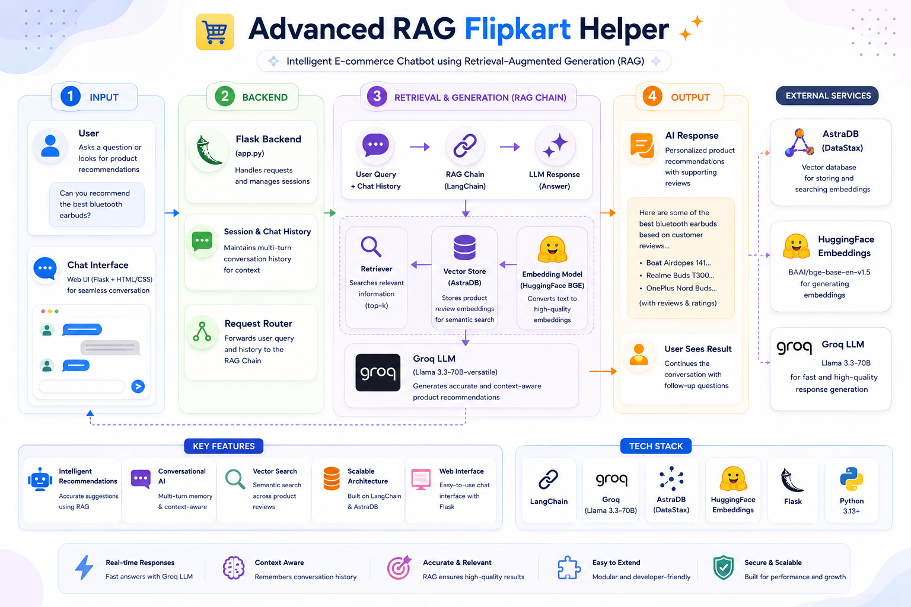

# 🛍️ Advanced RAG Flipkart Helper



An intelligent e-commerce chatbot powered by **Retrieval-Augmented Generation (RAG)** that provides product recommendations and customer support for Flipkart products using advanced LLM technology.

---

## 📋 Table of Contents

- [Features](#features)
- [Tech Stack](#tech-stack)
- [Project Structure](#project-structure)
- [Prerequisites](#prerequisites)
- [Installation](#installation)
- [Configuration](#configuration)
- [Usage](#usage)
- [How It Works](#how-it-works)
- [API Endpoints](#api-endpoints)
- [Example Queries](#example-queries)
- [Architecture](#architecture)
- [Contributing](#contributing)
- [License](#license)

---

## ✨ Features

- **Intelligent Product Recommendations**: Uses RAG to provide accurate product suggestions based on customer reviews and product data
- **Conversational AI**: Maintains chat history for context-aware responses across multiple turns
- **Vector Search**: Leverages embeddings for semantic similarity search across product database
- **Multi-turn Memory**: Remembers conversation history and can reference previous questions
- **Scalable Architecture**: Built on LangChain with AstraDB vector database
- **Web Interface**: User-friendly chat interface powered by Flask
- **Groq LLM Integration**: Uses Llama 3.3-70B for fast and efficient inference

---

## 🛠️ Tech Stack

### Core Technologies
- **LLM**: Groq (Llama 3.3-70B-versatile)
- **Vector DB**: AstraDB (DataStax)
- **Embeddings**: HuggingFace BGE (BAAI/bge-base-en-v1.5)
- **Framework**: LangChain
- **Web Framework**: Flask
- **Data Processing**: Pandas, Jupyter Notebook
- **Language**: Python 3.13+

### Key Libraries
```
langchain==1.3.9
langchain-astradb==1.0.0
langchain-groq==1.1.3
langchain-community==0.4.2
flask==3.1.3
pandas==3.0.3
sentence-transformers==5.6.0
python-dotenv==1.2.2
```

---

## 📁 Project Structure

```
advance_rag_flipkart_helper/
├── flipkart/                          # Main package
│   ├── __init__.py
│   ├── data_converter.py             # Convert CSV to Document format
│   ├── data_ingestion.py             # Handle data ingestion to AstraDB
│   └── retrieval_generation.py       # RAG chain implementation
├── templates/                         # Frontend templates
│   └── chat.html                     # Chat interface UI
├── static/                           # Static assets
│   └── style.css                     # Chat UI styling
├── content/                          # Data directory
│   └── flipkart_product_review.csv   # Product review dataset
├── flipkart-Bot.ipynb                # Jupyter notebook (development)
├── app.py                            # Flask application
├── requirements.txt                  # Project dependencies
├── pyproject.toml                    # Python project config
├── .env                              # Environment variables (not tracked)
├── .gitignore                        # Git ignore rules
├── .python-version                   # Python version specification
└── README.md                         # This file
```

---

## 📦 Prerequisites

- Python 3.13+
- pip or conda
- HuggingFace API Token
- Groq API Key
- AstraDB credentials (endpoint, token, keyspace)

---

## 🚀 Installation

### 1. Clone the Repository

```bash
git clone https://github.com/paras160500/advance_rag_flipkart_helper.git
cd advance_rag_flipkart_helper
```

### 2. Create a Virtual Environment

```bash
python -m venv venv
source venv/bin/activate  # On Windows: venv\Scripts\activate
```

### 3. Install Dependencies

```bash
pip install -r requirements.txt
```

---

## ⚙️ Configuration

### 1. Create `.env` File

Create a `.env` file in the root directory with the following variables:

```env
# HuggingFace API
HF_TOKEN=your_huggingface_api_token

# Groq API
groq_api=your_groq_api_key

# AstraDB Configuration
astra_db_end_point=your_astradb_endpoint
astra_db_token=your_astradb_token
astra_db_keyspace=your_astradb_keyspace
```

### 2. Prepare Data

Place your Flipkart product review CSV file in the `content/` directory:
```
content/flipkart_product_review.csv
```

The CSV should have at least these columns:
- `product_title`: Name of the product
- `review`: Customer review text

---

## 💻 Usage

### Option 1: Development with Jupyter Notebook

Run the interactive development notebook:

```bash
jupyter notebook flipkart-Bot.ipynb
```

This notebook shows the complete workflow:
1. Load and process product reviews
2. Convert data to LangChain Document format
3. Generate embeddings using HuggingFace
4. Store embeddings in AstraDB
5. Set up RAG chain with chat history
6. Test the chatbot

### Option 2: Run the Web Application

Start the Flask web server:

```bash
python app.py
```

The application will be available at: `http://localhost:5000`

---

## 🧠 How It Works

### 1. **Data Ingestion**
- Read Flipkart product reviews from CSV
- Convert to LangChain `Document` objects with metadata

### 2. **Embedding Generation**
- Use HuggingFace BGE model to generate dense embeddings
- Each product review is converted to a vector representation

### 3. **Vector Storage**
- Store embeddings in AstraDB vector database
- Enables semantic similarity search

### 4. **Retrieval**
- User query is processed by the RAG retriever
- Similar product reviews are fetched (top-k retrieval)
- Context is maintained across conversation turns

### 5. **Generation**
- Retrieved context + user query → LLM (Groq Llama)
- Chat history is considered for follow-up questions
- Response is generated with product recommendations

### 6. **Memory Management**
- Session-based chat history storage
- Maintains context across multiple turns
- Can reference previous questions

---

## 🔌 API Endpoints

### GET / (Index)
Returns the chat interface HTML page

```bash
curl http://localhost:5000/
```

### POST /get (Chat)
Send a user message and receive a chatbot response

**Request:**
```bash
curl -X POST http://localhost:5000/get \
  -d "msg=Can you recommend the best bluetooth earbuds?"
```

**Response:**
```
Product recommendations based on your query...
```

---

## 💬 Example Queries

```
1. "Can you tell me the best bluetooth buds?"
2. "What is my previous question?"
3. "Show me reviews for smartphone cases"
4. "Which product has the best customer rating?"
5. "What do customers say about laptop stands?"
```

---

## 🏗️ Architecture


The flow starts at the **User Interface** and moves through the **Flask Backend**, which splits the request into the current **Query** and the stored **Chat History**. Both feed into the **RAG Chain**, which coordinates the **Retriever**, **Prompt**, and **Groq LLM**. The Retriever pulls relevant context from the **AstraDB Vector Store**, which holds the product review embeddings.

---

## 🤝 Contributing

Contributions are welcome! Please feel free to submit a Pull Request.

1. Fork the repository
2. Create your feature branch (`git checkout -b feature/AmazingFeature`)
3. Commit your changes (`git commit -m 'Add some AmazingFeature'`)
4. Push to the branch (`git push origin feature/AmazingFeature`)
5. Open a Pull Request

---

## 📝 License

This project is open source and available under the MIT License.

---

## 📞 Support

For issues and questions, please open an issue on GitHub.

---

## 🙏 Acknowledgments

- [LangChain](https://langchain.com/) for the RAG framework
- [Groq](https://groq.com/) for the Llama LLM
- [DataStax AstraDB](https://www.datastax.com/products/datastax-astra) for vector database
- [HuggingFace](https://huggingface.co/) for embeddings

---

**Made with ❤️ by Paras**